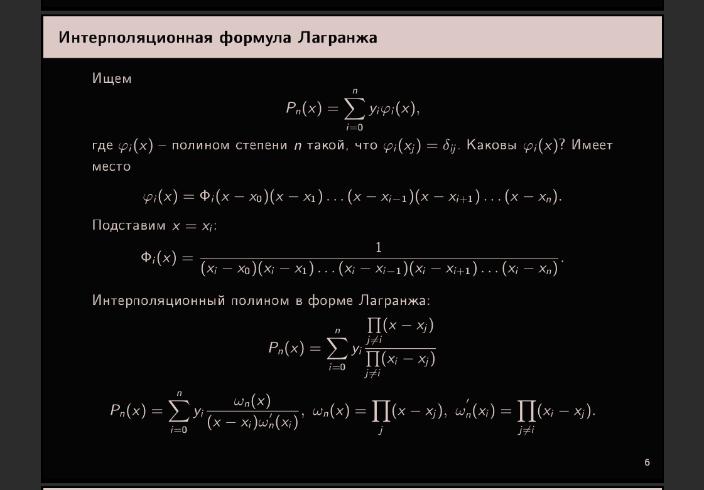
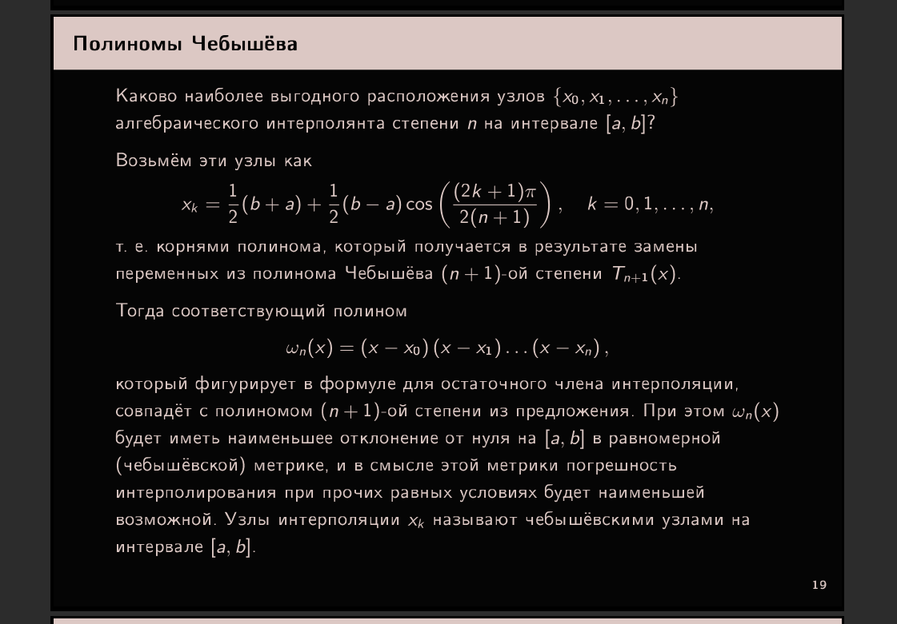
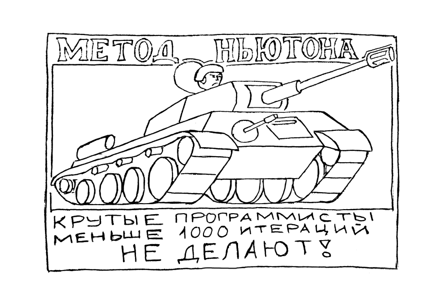

Объяснение роста ошибки интерполяции:

    кароче, на равномерной сетке можно брать точку на середине i-го интервала и смотреть, как изменяется функция расстояния dist(x) = П(x - x_j), j=0...n (Спойлер -- будет расти от центра к концам отрезка). если аккуратно расписать, всё легко показывается(посмотри отношение dist(x_i)/dist(x_{i+1}), где x_i, x_{i+1} -- середины i-го и {i+1}-го интервалов соответственно).

......................................................

    аналитически для чебышёва -- хз, там уже надо нормально так оценивать, но идейно(и полу-интуитивно) -- это потому что у тебя узлы сгущаются ближе к концам отрезка, т.е., если взять х ближе к краю, то у тебя в dist(x) будет много "маленьких" множителей. хотя, с другой стороны, у тебя также будет много "больших" множителей от узлов с другого конца[а узлы чебышёва распределены симментрично относительно центра отрезка], поэтому я и написал "полу-интуитивно" :)

