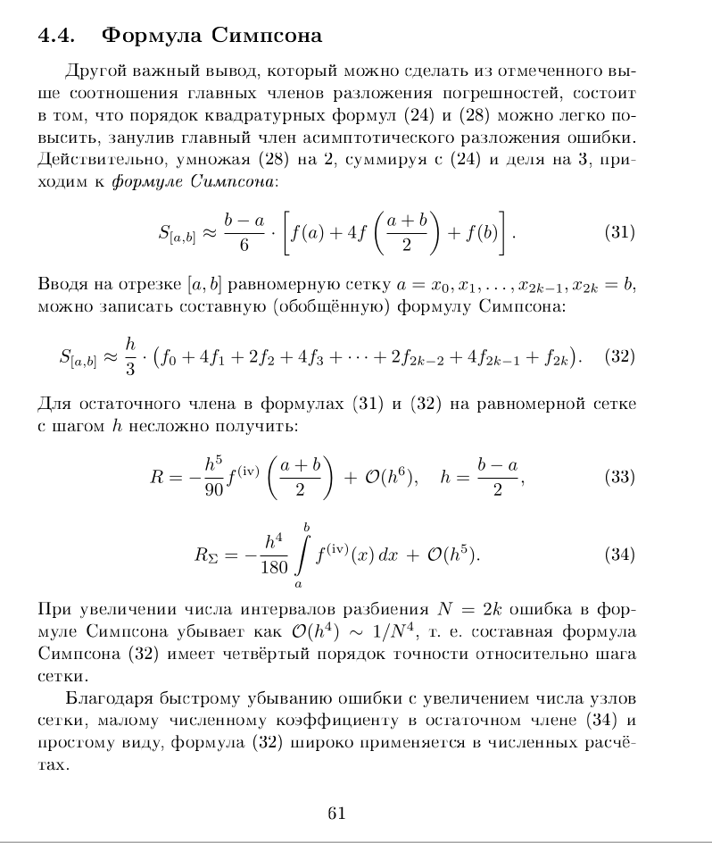
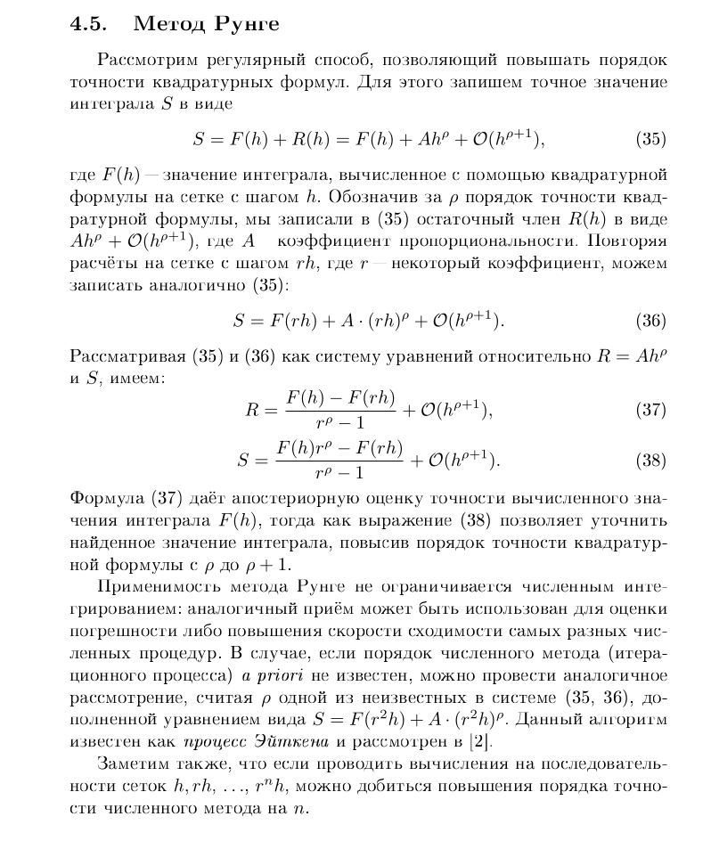
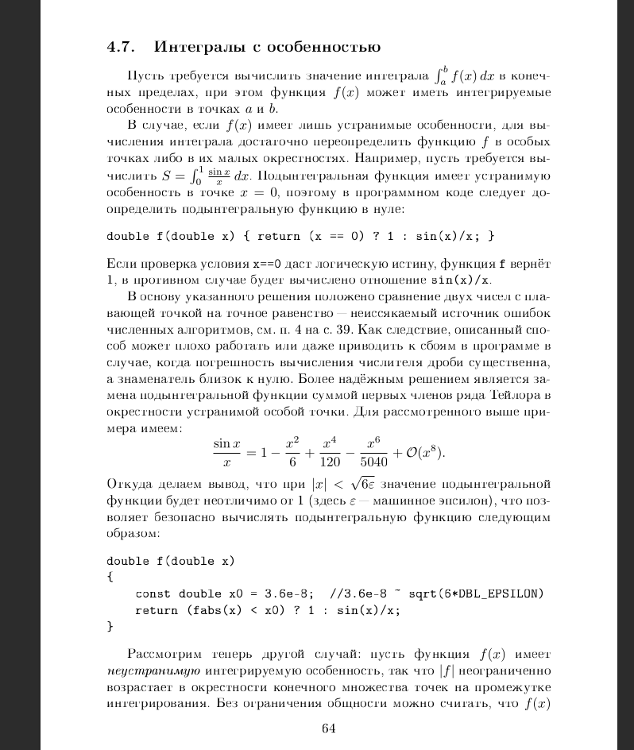
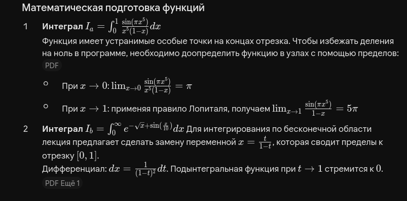
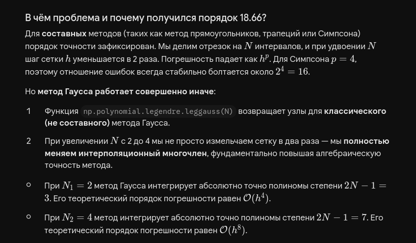
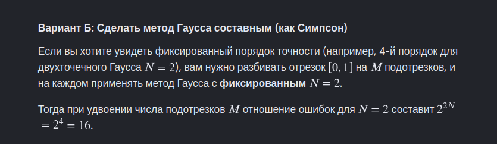

> кароче, на тестовом примере для оценки Гаусса я сначала попытался сделать как для Симпсона(тупо увеличить N), но это ошибка(у меня получался неправильный порядок). ниже приведено объяснение:

> как исправить? а вот так(написать функцию composite_gauss_method):

