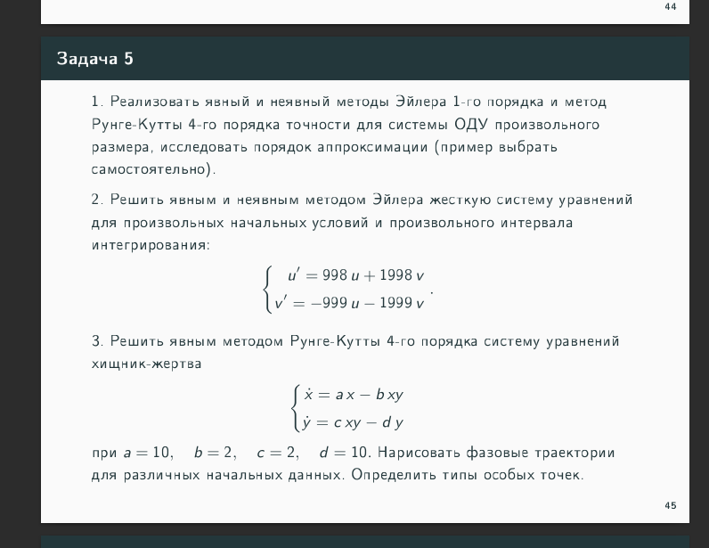
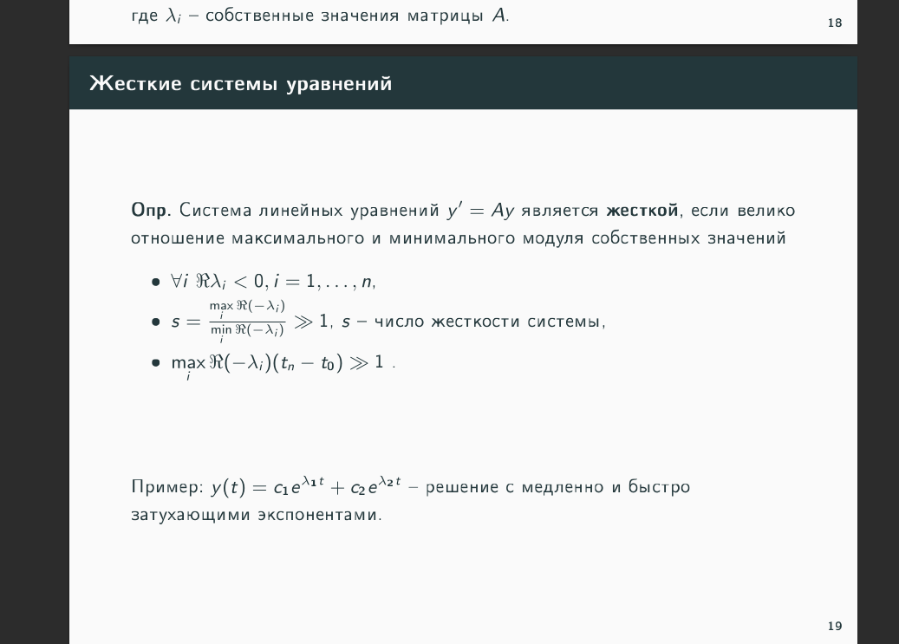
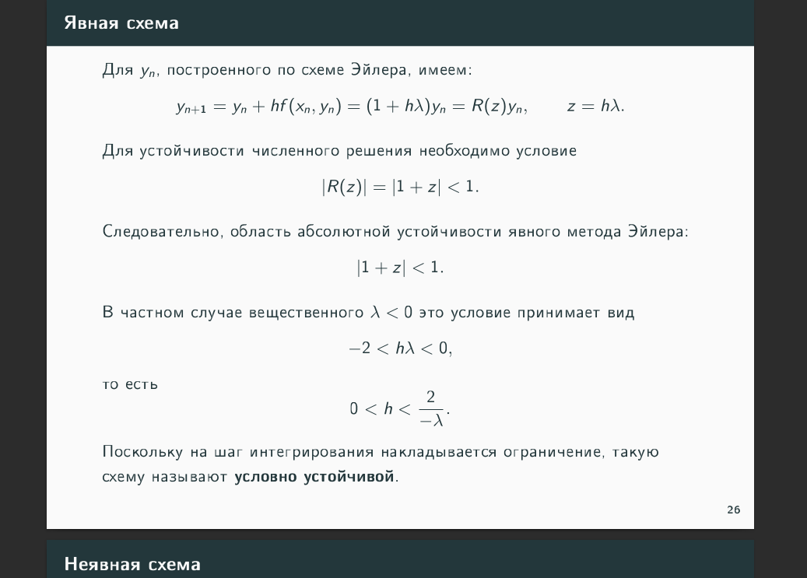
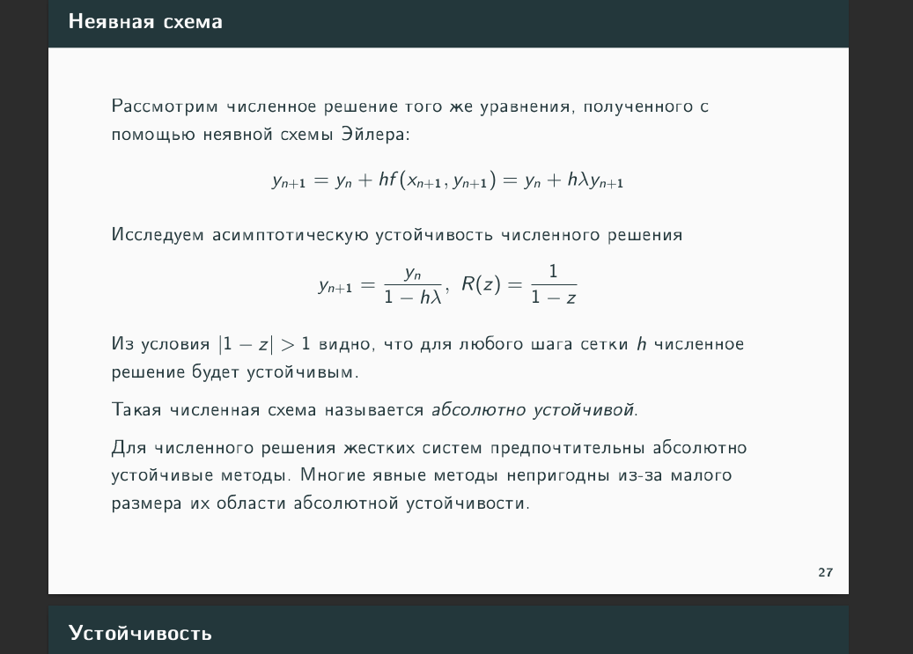
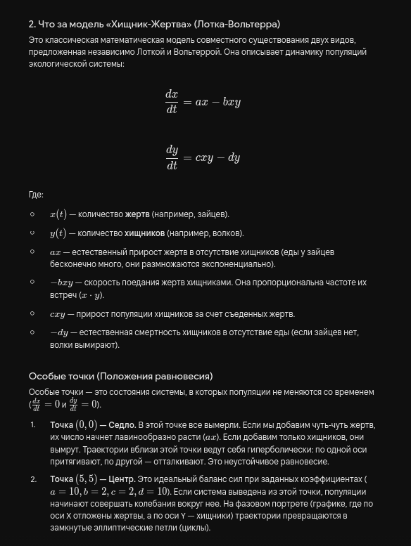

 

-------------------------------------------------
***!!! я пишу эту редмишку спустя больше месяца после сдачи, поэтому примерные вопросы !!!***
-------------------------------------------------
кароче, если честно, я не помню точно, что он спрашивал, но примерно таких знаний должно хватить:

> явный метод эйлера 1-го порядка _условно устойчивый_, т.к. у него на шаг инегрирования накладывается ограничение **$h < \frac{2}{|λ_{max}|}$** 

> а вот неявный метод эйлера 1-го порядка _абсолютно устойчивый_

> в жёсткой системе(опр жёсткой системы смотри ниже) применяя первый пункт, понимаем, что на отрезке [a, b] шаг сетки должен быть **$\frac{b - a}{n} = h < \frac{2}{|λ_{max}|}$ ==> $n > \frac{(b-a) \cdot |λ_{max}|}{2}$**, где **n** -- кол-во узлов сетки.

> в задаче в жёсткой системе собственные числа **$λ_1=1$** и **$λ_2=1000$** (вроде так, мб в знаках ошибся). то есть на отрезке [0, 0.1] при **n < $\frac{0.1 \cdot 1000}{2} = 50$** явный метод разойдётся(что и показано на первом графике[обрати внимание на значения по y], когда взяли 40 точек). но если взять 60 точек, то уже результат более-менее приемлемый.

> метод рунге-кутты сам читай, дорогой читатель, я усталь :) я всё равно не помню, ч спрашивали

