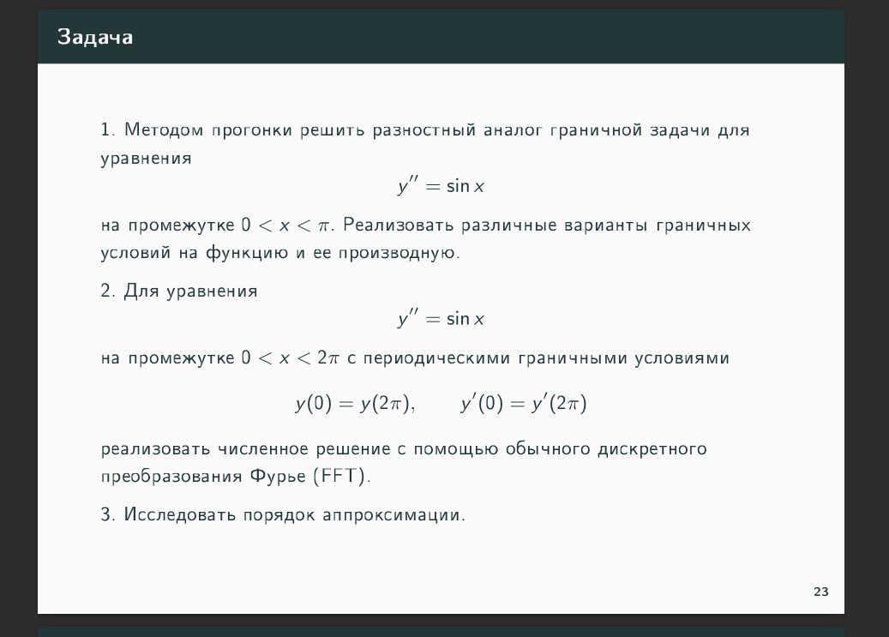
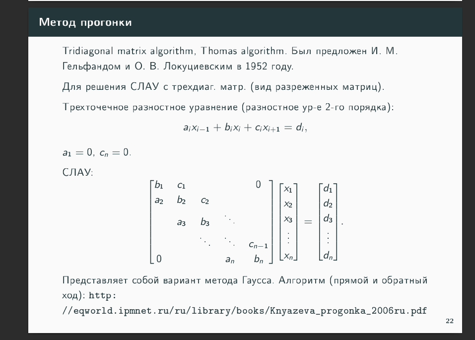
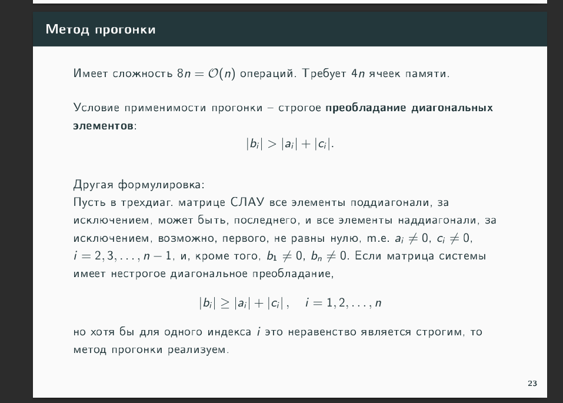
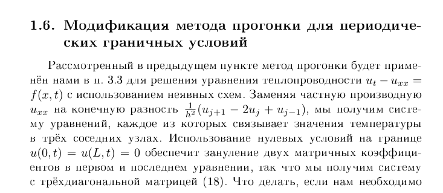
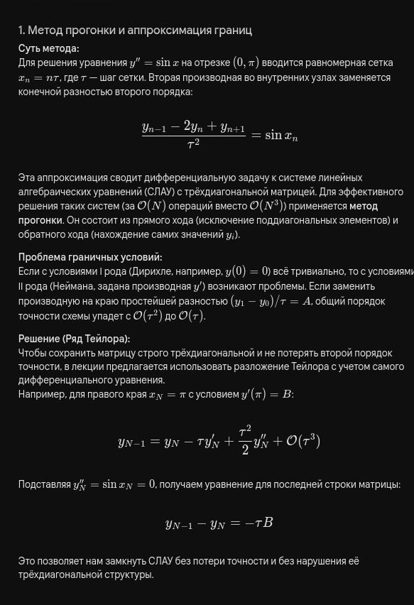

-------------------------------------------------
***!!! я пишу эту редмишку спустя больше месяца после сдачи, поэтому примерные вопросы !!!***
-------------------------------------------------

спрашивает на понимание:
1. **что решает метод прогонки(для чего используется)?** 
    - *ответ: для решения систем линейных алгебраических уравнений (СЛАУ) с трёхдиагональной матрицей.*

2. **как выглядит матрица?** 
    - *ответ: трёхдиагональная.*

3. **как мы из диффура перешли к СЛАУ?**
    - *ответ: заменили производную конечной разностью(смотри фото ниже).*

> к вопросу 3

